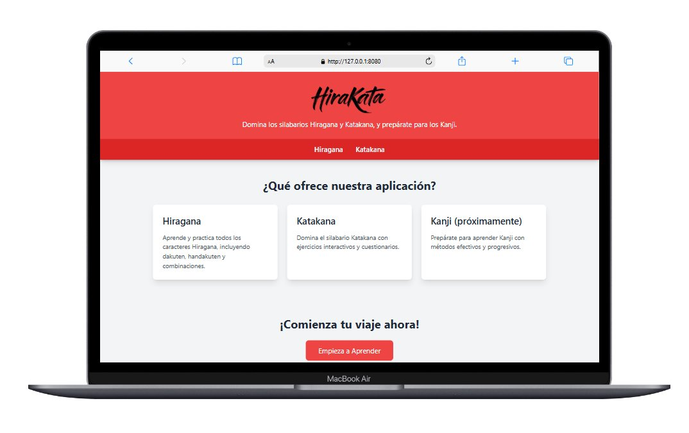
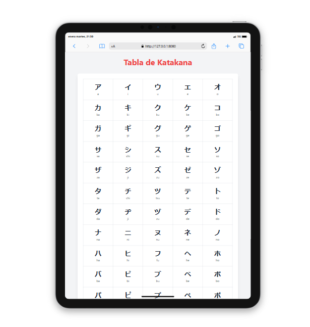
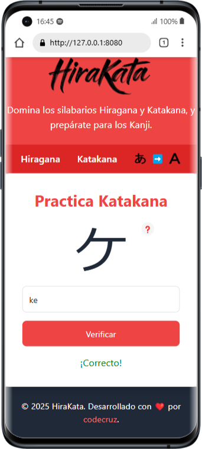
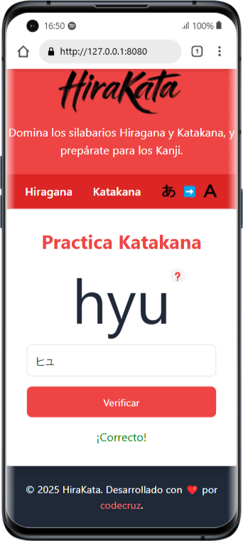

# HiraKata - Aplicación de Aprendizaje de Japonés

<div align="center">
  
</div>

HiraKata es una aplicación web moderna y accesible para aprender los caracteres japoneses Hiragana y Katakana. Construida con una arquitectura modular basada en componentes, proporciona una experiencia de aprendizaje interactiva y atractiva con soporte completo de internacionalización.

## 🌍 Funcionalidades de Internacionalización

### **Soporte Multi-idioma:**
- **Español** 🇪🇸 - Interfaz completamente en español
- **English** 🇺🇸 - Complete English interface  
- **日本語** 🇯🇵 - 完全な日本語インターフェース

### **Sistema i18n Avanzado:**
- Detección automática del idioma del navegador
- Persistencia de preferencias de idioma en localStorage
- Cambio dinámico de idioma sin recargar la página
- Sistema de traducciones con fallback inteligente
- Selector de idiomas integrado en el header

## 🏗️ Arquitectura

Esta aplicación utiliza una **arquitectura modular basada en componentes** con sistema de internacionalización completo:

### **Estructura del Proyecto:**
```
hirakata/
├── components/                 # Componentes modulares
│   ├── i18n.js                # Sistema de internacionalización
│   ├── template-engine.js     # Motor de plantillas con i18n
│   ├── language-selector-simple.html  # Selector de idiomas
│   ├── language-selector-simple.js    # Lógica del selector
│   ├── header.html            # Navegación principal
│   ├── footer.html            # Pie de página
│   ├── features-section.html  # Sección de características
│   ├── cta-section.html       # Llamada a la acción
│   ├── reference-tables.html  # Tablas de referencia
│   └── config.js              # Configuración centralizada
├── i18n/                      # Archivos de traducción
│   ├── es.json                # Traducciones en español
│   ├── en.json                # English translations
│   └── ja.json                # 日本語翻訳
├── data/                      # Datos de caracteres
│   ├── hiragana.json          # Conjunto completo de Hiragana
│   └── katakana.json          # Conjunto completo de Katakana
├── tests/                     # Archivos de prueba y debugging
│   ├── debug/                 # Herramientas de debugging
│   └── *.html                 # Páginas de prueba específicas
├── hiragana/                  # Módulo de práctica Hiragana
├── katakana/                  # Módulo de práctica Katakana
└── index.html                 # Página principal
```

### **Sistema de Componentes:**
- **Motor de plantillas** con soporte i18n integrado
- **Carga dinámica** de componentes modulares
- **Renderizado reactivo** cuando cambia el idioma
- **Configuración centralizada** para fácil mantenimiento

### **Características de Accesibilidad:**
- Estructura HTML semántica
- Soporte de navegación por teclado
- Elementos visuales de alto contraste
- Atributos ARIA apropiados
  <## 🎯 Planned Features

### **Upcoming Enhancements:**
- **Kanji Learning Module**: Comprehensive Kanji study system starting with basic characters
- **Advanced Learning Methods**: Flashcards, writing practice, and spaced repetition algorithms
- **Gamification System**: Points, achievements, and progress tracking
- **Performance Analytics**: Detailed learning statistics and improvement suggestions
- **Offline Support**: Progressive Web App capabilities for offline learning

### **Technical Roadmap:**
- Enhanced accessibility features (ARIA labels, screen reader improvements)
- Additional language localizations
- Advanced quiz customization options
- Social learning features and progress sharing

## 🛠️ Desarrollo

### **Configuración Inicial:**
1. Clonar el repositorio
2. Ejecutar servidor local (requerido para evitar CORS):
   ```bash
   node server.js
   ```
3. Abrir `http://localhost:3000` en el navegador

### **Estructura de Desarrollo:**
- **Servidor Node.js**: `server.js` - Servidor estático para desarrollo
- **Configuración**: `postcss.config.js`, `tailwind.config.js`
- **Estilos**: `styles.css` con Tailwind CSS

### **🧪 Carpeta de Pruebas (`tests/`)**
La carpeta `tests/` contiene archivos de desarrollo y debugging que **NO** forman parte de la aplicación de producción:

#### **Archivos de Debug:**
- `tests/debug/debug-i18n.html` - Debugging del sistema de internacionalización
- `tests/debug/debug-selector.html` - Debugging del selector de idiomas

#### **Archivos de Prueba:**
- `tests/test-i18n.html` - Pruebas del sistema i18n
- `tests/test-language-*.html` - Pruebas del selector de idiomas
- `tests/test-selector-*.html` - Pruebas específicas del selector

#### **Acceso durante desarrollo:**
```
http://localhost:3000/tests/[archivo].html
```

### **Añadir Funcionalidades:**
Cuando añadas nuevas funcionalidades:
- Crear componentes reutilizables en `components/`
- Actualizar `config.js` para nuevas opciones
- Añadir traducciones en los archivos `i18n/*.json`
- Seguir las mejores prácticas de accesibilidad

## ✨ Funcionalidades Actuales

### **📚 Tablas de Caracteres Hiragana y Katakana**
Tablas de referencia completas para todos los caracteres Hiragana y Katakana, incluyendo caracteres básicos, dakuten (゛), handakuten (゜), y combinaciones (ej: きゃ, きゅ, きょ).

<div align="center">
  
</div>

### **🎯 Cuestionarios de Práctica Interactivos**
Sistema de cuestionarios dinámicos con múltiples modos para probar tu conocimiento de los caracteres japoneses:

<div align="center">
  
  
</div>

**Características del Cuestionario:**
- Selección aleatoria de caracteres del conjunto completo
- **Modo Normal**: Ver el carácter, escribir el Romaji
- **Modo Inverso**: Ver el Romaji, escribir el carácter
- Feedback inmediato y seguimiento de progreso

## 🎯 Funcionalidades Planificadas

### **Próximas Mejoras:**
- **Módulo de Aprendizaje Kanji**: Sistema completo de estudio Kanji comenzando con caracteres básicos
- **Métodos de Aprendizaje Avanzados**: Tarjetas de memoria, práctica de escritura, y algoritmos de repetición espaciada
- **Sistema de Gamificación**: Puntos, logros, y seguimiento de progreso
- **Análisis de Rendimiento**: Estadísticas detalladas de aprendizaje y sugerencias de mejora
- **Soporte Offline**: Capacidades de Progressive Web App para aprendizaje offline

### **Roadmap Técnico:**
- Funciones de accesibilidad mejoradas
- Localizaciones de idiomas adicionales
- Opciones avanzadas de personalización de cuestionarios
- Funciones de aprendizaje social y compartición de progreso

## 📝 Estado y Feedback

**Estado Actual**: Trabajo en Progreso (WIP)

Esta aplicación está siendo desarrollada iterativamente para asegurar una experiencia de aprendizaje de alta calidad. ¡Tu feedback es invaluable!

Si encuentras algún problema, tienes sugerencias de mejora, o puedes contribuir con capturas de pantalla, no dudes en abrir un issue o contactarme.

---

**HiraKata** - Aprende japonés de manera moderna, accesible e internacionalizada 🌍
